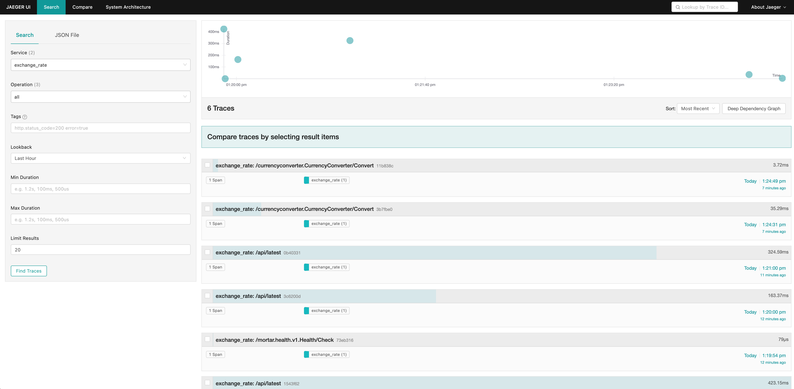
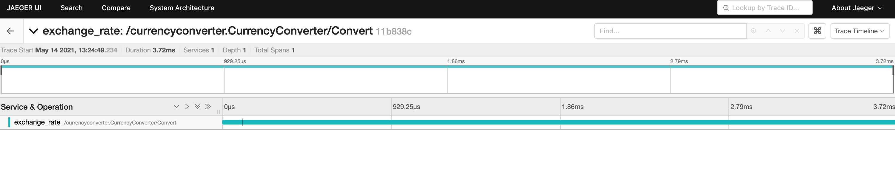
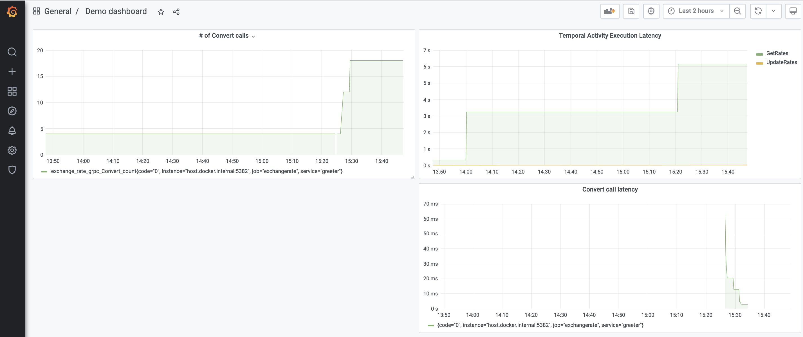

# Go currency rate

This is a somewhat educational repository to show how to implement gRPC web service using 
[Mortar](https://github.com/go-masonry/mortar) and [Temporal](https://temporal.io/) orchestrator to achieve reliable
service that depends on external third-party services.

The code in this repository implements idea taken from one of the technical interviews: implementation of currency 
conversion service, that relies on one of many currency exchange APIs available online. There is a catch though - the 
service should be functioning even in case the external API is not available. 

In general, this service could be divided into two: 
* One service that periodically calls external API, fetches data and stores it in DB.
* Another service to provide REST/gRPC API for latest information stored in the DB.

Having said that, since there is not much code anyway, the above two functionalities are merged into one service that 
resides in this repository.


## High level architecture

The service is based on [Mortar](https://github.com/go-masonry/mortar) template, which provides a framework to implement 
gRPC/REST API web service. The web API itself is located in [currency_converter.proto](../blob/master/api/currency_converter.proto)

In addition, there is a code that uses Temporal Golang sdk to create a cron workflow, which runs periodically, fetches 
currencies rates and stores rates in DB (MongoDB).

I chose to use fixer.io as a currency rates provider. If from some reason this choice doesn't suite you, feel free to 
add a wrapper of you choice and replace [exchange_client.go](../blob/master/app/clients/exchange_client.go) with your code.
 

## How to run the code locally

In order to run the code locally, you need to have access to a Temporal cluster and to a Mongo DB instance.
Below commands show how one can easily achieve it using docker images provided by Temporal and Mongo.

### Run Temporal server:
```bash
mkdir temporal && cd temporal
git clone https://github.com/temporalio/docker-compose.git
cd docker-compose
docker-compose up -d
```
The first time you run Temporal's docker-compose, it will take some time for initialization of all the components it needs.

### Run MongoDB:
```bash
docker run --name mongo -p 27017:27017 -d mongo
```

That's it - you have all dependencies running locally, now you can run the service locally:

### Run currency converter service:
```bash
make run
```

### Examples:

Once the service is up and running, you can start using it.
Example for getting conversion rate of 300 EUR to ILS:
```shell script
curl -X "POST" "http://localhost:5381/v1/convert" \                                                                                                                                                                                                                 10060
     -H 'Content-Type: application/json; charset=utf-8' \
     -d $'{"currency_from": "EUR", "currency_to": "ILS", "amount_from": 300}'

{"currency":"ILS","amount":1189.4362,"correctnessTime":"2021-05-14T10:06:14Z"}     
```


### Metrics and monitoring

Since Mortar comes with a built-in ability to report metrics, it's very easy to demonstrate it with this service.
In **docker** directory you can find all necessary files to run locally Graphana/Jaeger/Prometheus images.

> Open a shell, change directory to `go-currency-converter/docker` now run the following
```shell script
docker-compose up
``` 

This should bring up the following services

* [Prometheus](http://localhost:9090)
* [Jaeger](http://localhost:16686)
* [Grafana](http://localhost:3000)

* [Jaeger](http://localhost:16686) can show you all requests that you've made to the service or all requests that had been performed by Temporal cron service.

  


* [Prometheus](http://localhost:9090) and [Grafana](http://localhost:3000) can be sued to visualize reported metrics.
Since Mortar provides built-in metrics reports, one can enjoy it out of the box:
  
